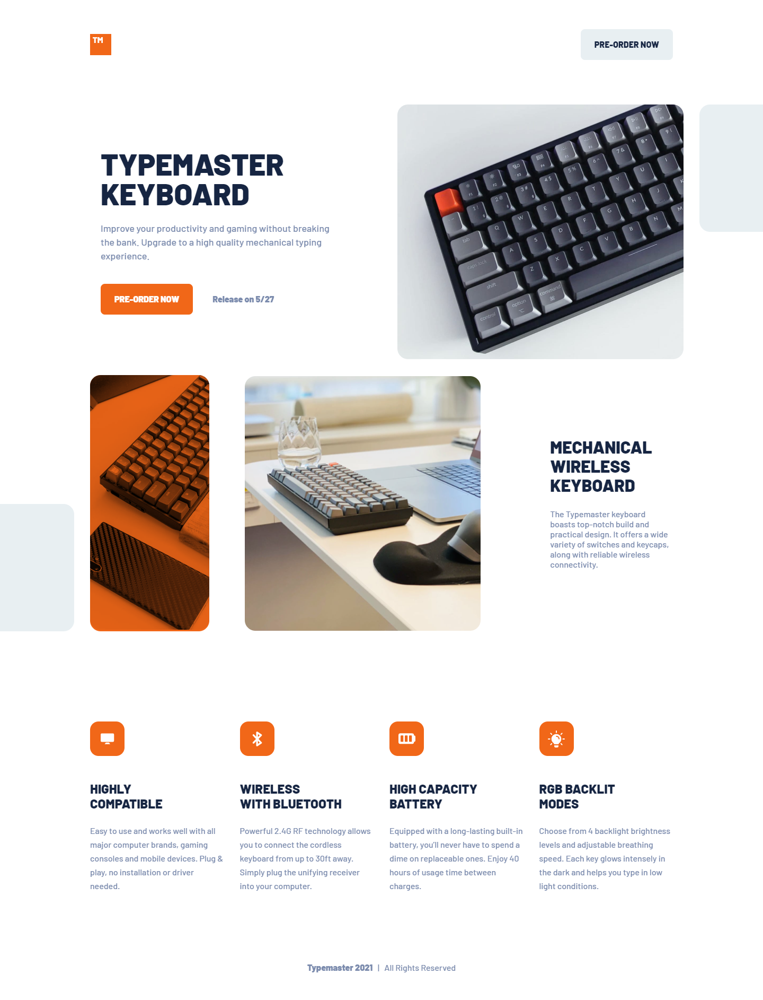
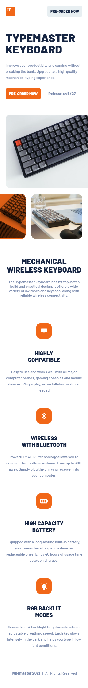

# Frontend Mentor - Typemaster pre-launch landing page solution

This is a solution to the [Typemaster pre-launch landing page challenge on Frontend Mentor](https://www.frontendmentor.io/challenges/typemaster-prelaunch-landing-page-J6-Yj5J-X). Frontend Mentor challenges help you improve your coding skills by building realistic projects.

## Table of contents

-  [Overview](#overview)
   -  [The challenge](#the-challenge)
   -  [Screenshot](#screenshot)
   -  [Links](#links)
   -  [Built with](#built-with)
   -  [What I learned](#what-i-learned)
-  [Author](#author)

## Overview

### The challenge

Users should be able to:

-  View the optimal layout for the page depending on their device's screen size
-  See hover states for all interactive elements on the page

### Screenshot

### Links

-  Live Site URL: (https://devubong-typemaster.netlify.app/)

### Built with

-  Semantic HTML5 markup
-  Tailwind css

### What I learned

Tailwind css. First time I've used it. Fun Stuff

## Author

-  Website - [Ubong Usoro](https://www.devubong.com)
